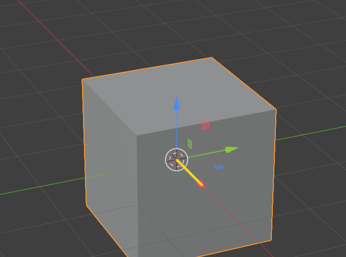
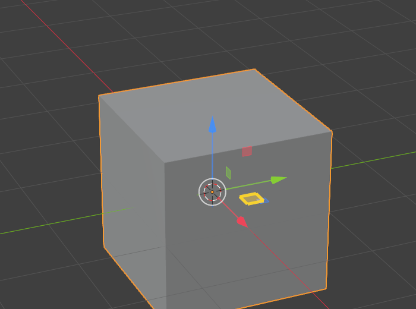
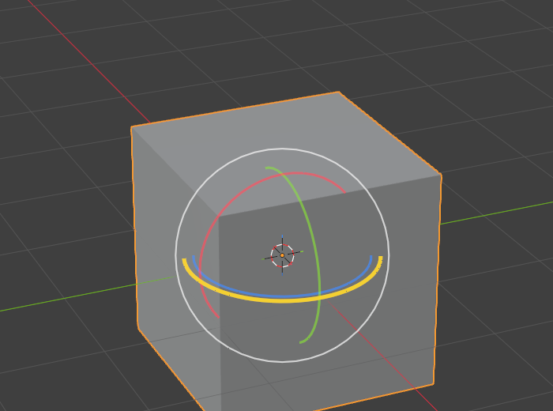

# Maya Gizmo for Blender

Bring Autodesk Maya's *"transform along the last used axis"* workflow to
Blender's 3D viewport.

In Maya, once you have used a gizmo handle, that handle stays highlighted and
you can keep transforming along it by middle-mouse-dragging anywhere in the
viewport, without having to hit the handle again. This addon does the same in
Blender.

| Move along one axis | Move on a plane | Rotate around an axis |
|---|---|---|
|  |  |  |

---

## What it does

**1. It remembers the last axis you used.**

Drag the X arrow of the move gizmo, or the XY plane handle, or press `G` `X` on
the keyboard — either way the addon remembers *Move, X, Global*. Rotation dials,
scale handles, plane handles and the screen-space / uniform handles are all
tracked, along with the transform orientation you used.

**2. It highlights that handle in yellow.**

The remembered handle is drawn in yellow on top of Blender's own gizmo, so you
can always see what a middle mouse drag is about to do.

**3. Middle-mouse-drag re-runs that transform, anywhere in the viewport.**

Press MMB, drag, release. It is a real interactive transform: the drag distance
drives the amount, the header shows the live value, and it confirms when you
release the button. You never have to hit the handle itself.

**4. Viewport orbit moves to right-mouse-drag.**

Since MMB is now the transform, orbit moves to right-mouse-drag. A normal right
click still opens the context menu.

---

## Install

**Requires Blender 4.2 or newer** (it is packaged as a Blender Extension).
Developed and tested on Blender 5.1.

1. Download `maya_gizmo-<version>.zip` from the
   [Releases page](https://github.com/cubosaur/maya-gizmo-for-blender/releases/latest).
2. Drag the zip straight into a Blender window and confirm.

   *Or:* **Edit ▸ Preferences ▸ Add-ons ▸ ▾ ▸ Install from Disk…** and pick the zip.
3. Enable **Maya Gizmo** in the add-on list if it is not enabled already.

The keymap changes are applied as soon as the addon is enabled, and reverted as
soon as it is disabled.

---

## Keymap

Applied while the addon is enabled, in the 3D viewport only:

| Input | Before | After |
|---|---|---|
| **MMB drag** | Orbit | **Transform along the last used axis** |
| **RMB drag** | *(unassigned)* | **Orbit** |
| **RMB click** | Context menu (on press) | Context menu (on release) |
| Shift+MMB | Pan | Pan *(unchanged)* |
| Ctrl+MMB | Zoom | Zoom *(unchanged)* |
| Shift+Ctrl+MMB | Dolly | Dolly *(unchanged)* |
| Shift+RMB | Place 3D cursor | Place 3D cursor *(unchanged)* |

Pan and zoom are separate keymap entries from the middle mouse orbit, so they
are never touched. The only reason the context menu is retimed from press to
release is that a menu opening on press would swallow the drag before it could
orbit — a normal right click still opens it.

If nothing is selected, or you have not used an axis yet, a middle mouse drag
just orbits as it always did.

## Resetting your hotkeys

Two independent guarantees, because a broken viewport is not a fun surprise:

- **Automatic.** Disabling or removing the addon reverts every keymap change.
- **Manual.** **Preferences ▸ Add-ons ▸ Maya Gizmo ▸ Reset Hotkeys**, or the
  same button in **View3D ▸ Sidebar (N) ▸ View ▸ Maya Gizmo**.

Every change is written to a backup record in the addon preferences *before* it
is made, so a reset restores exactly what you had — including your own prior
customisations, and including after an unclean shutdown.

If the keymap ever ends up in a state a reset cannot fix, there is a
**Restore Blender Default Keymaps** button as a last resort. It resets the
affected keymaps to factory defaults, which also discards your own edits in
them, so it asks for confirmation first.

---

## Preferences

**Edit ▸ Preferences ▸ Add-ons ▸ Maya Gizmo**

### Middle mouse transform

| Setting | Default | |
|---|---|---|
| Middle Mouse Transform | on | Master switch. Off leaves the default MMB orbit alone. |
| Activation | On Press | *On Press* starts immediately (matches Maya). Switch to *On Drag* if your input device misbehaves. |
| Transform Type | Last Used | *Last Used* repeats your last transform. *Active Tool* follows the Move/Rotate/Scale tool instead, falling back to the last used transform for other tools. |
| Orbit When Nothing To Transform | on | Middle mouse drag orbits when there is no axis or no selection. |

### Navigation

| Setting | Default | |
|---|---|---|
| Orbit With Right Mouse Drag | on | Adds RMB-drag orbit. |
| Context Menu On Click | on | Retimes the viewport context menus from press to click. |
| Also Pan/Zoom With Right Mouse | **off** | Adds Shift+RMB pan and Ctrl+RMB zoom. Off by default because those collide with placing the 3D cursor and with lasso select. Pan and zoom already work on Shift+MMB and Ctrl+MMB. |

### Highlight

Colour, opacity, line width, size, whether to show it at all, and whether to
hide it when viewport gizmos are off.

---

## How it works

Blender's transform gizmo is C code with no Python-visible "this handle was
dragged" callback, so the addon does not hook the gizmo. It reads the *result*:
every finished transform lands in `wm.operators` carrying its `constraint_axis`
and `orient_type` — the same data the F9 redo panel shows. One code path
therefore covers gizmo drags and keyboard shortcuts equally.

The highlight is drawn in a `POST_PIXEL` draw handler. Blender draws 3D gizmos
between the `POST_VIEW` and `POST_PIXEL` callbacks, so `POST_PIXEL` is what
lands on top of the gizmo, and working in screen space means the highlight is
automatically the same pixel size as the gizmo.

The middle mouse binding starts a genuine `transform.translate` / `rotate` /
`resize` with `release_confirm` set, which is why it feels identical to dragging
the handle rather than like a scripted nudge.

### Known limitations

- The highlight is drawn **over** Blender's gizmo rather than recolouring the
  handle itself, which Python cannot do. On a plane handle you may see a sliver
  of the original colour at the edge.
- For the **Normal** and **Gimbal** orientations the highlight is drawn using
  the object's own axes, which is exact in Object Mode but only an approximation
  in Edit Mode. The transform itself is always correct — only the drawing
  approximates.
- The highlight pivot is computed properly for Object Mode, Edit Mode (mesh) and
  Pose Mode. Other edit modes fall back to the object origin.
- On the **right-click-select** keymap the RMB-drag orbit is skipped
  automatically, since right mouse already selects there. Everything else works.
- In **sculpt and paint modes** right mouse is bound to brush stencil controls,
  which take priority, so RMB-drag orbit does not apply there.

---

## Development

```bash
git clone https://github.com/cubosaur/maya-gizmo-for-blender.git
cd maya-gizmo-for-blender
```

Build the installable zip — either with Blender:

```bash
blender --command extension build
```

or without it, using only the standard library:

```bash
python tools/build.py --output-dir dist
```

Validate the manifest:

```bash
blender --command extension validate .
```

Releases are cut by pushing a `v*` tag; CI checks that the tag matches the
version in `blender_manifest.toml`, builds the zip and attaches it to the
GitHub release.

---

## License

[GPL-3.0-or-later](LICENSE), matching Blender's own licensing for addons.
